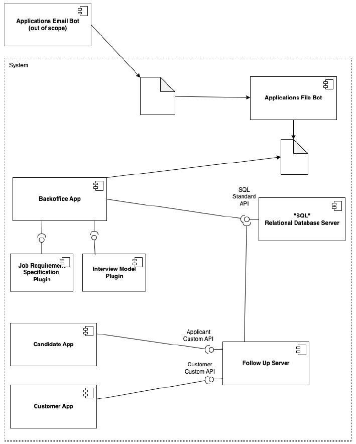

# US G003

## 1. Context

*Explain the context for this task. It is the first time the task is assigned to be developed or this tasks was incomplete in a previous sprint and is to be completed in this sprint? Are we fixing some bug?*

## 2. Requirements

*As Project Manager, I want the team to configure the project structure to facilitate / accelerate the development of upcoming user stories.*

**Dependencies/References:**

Define the structure of the project to support the envisioned architecture, including support for adopted technologies

## 3. Analysis

## 4. Design

*NA*

### 4.1. Realization

*NA*

### 4.2. Class Diagram

*NA*

### 4.3. Applied Patterns

*NA*

### 4.4. Tests

*NA*

## 5. Implementation

*NA*

## 6. Integration/Demonstration

*NA*

## 7. Observations

*NA*