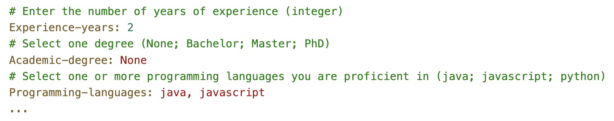

# UC 1009 - As Customer Manager, I want to select the requirements specification to be used for a job opening.

## 1. Design

>* Use layer structure architecture
>  * Domain class: RequirementsSpecification
>  * Controller: RequirementSpecificationController
>  * Repository: RequirementSpecificationRepository

## 2. Example of a template text file with requirements

