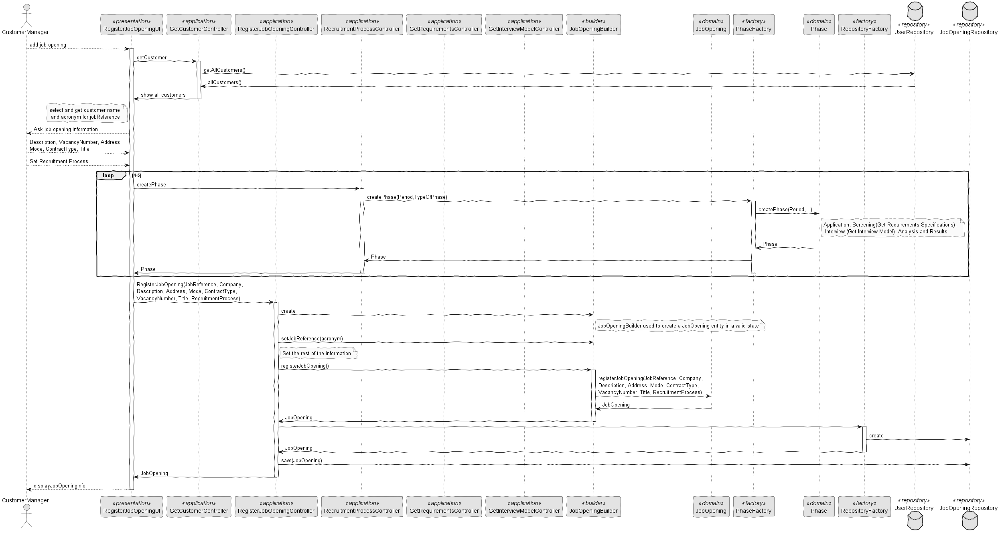

# System Design: Job Opening Registration System

## Overview
This document outlines the design of a system for registering job openings. It describes the interactions between various components including UI, controllers, domain entities, and repositories.

## Components
- **Actor**: Represents the user interacting with the system.
- **RegisterJobOpeningUI (UI)**: Handles the user interface for adding job openings.
- **GetCustomerController (CustomerController)**: Retrieves customer information.
- **RegisterJobOpeningController (Controller)**: Registers job openings.
- **RecruitmentProcessController (RPController)**: Manages the recruitment process.
- **GetRequirementsController (ReqController)**: Handles getting requirements specifications.
- **GetInterviewModelController (IMController)**: Manages getting interview models.
- **JobOpeningBuilder (Builder)**: Constructs job opening entities.
- **JobOpening (Domain)**: Represents a job opening entity.
- **PhaseFactory (PFactory)**: Creates phases for the recruitment process.
- **Phase (Phase)**: Represents a phase in the recruitment process.
- **RepositoryFactory (Factory)**: Creates repositories for storing data.
- **UserRepository (URepository)**: Stores user-related data.
- **JobOpeningRepository (Repository)**: Stores job opening data.

