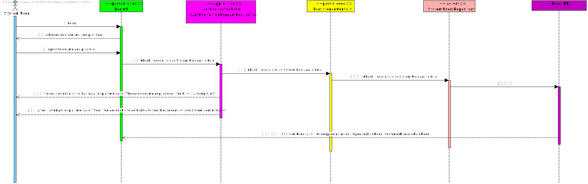

# US g007 - Apply authentication and authorization for all users

## 1. Requirements Engineering
* As a Project Manager, I want to the system to support and apply authentication and authorization 
for all its users and functionalities.
* Priority: 1

## 2. Customer Specifications and Clarifications
* From the client clarifications:

>Question: n/a
>Answer: n/a

## 3. Acceptance Criteria

    AC1: All system users should be registered in the application in order to be able to use it.
    AC2: All system users should log in with an username and a password.
    AC3: Every system user has a specific role with that comes with it's own authorization level.

## 4. Found out Dependencies
* n/a

## 5 Input and Output Data

Input Data:

    Typed data:
        a username (String; mandatory)
        a password (String; mandatory)

## 6. System Sequence Diagram (SSD)

## 7. Tests

## 8. Observations
* n/a

