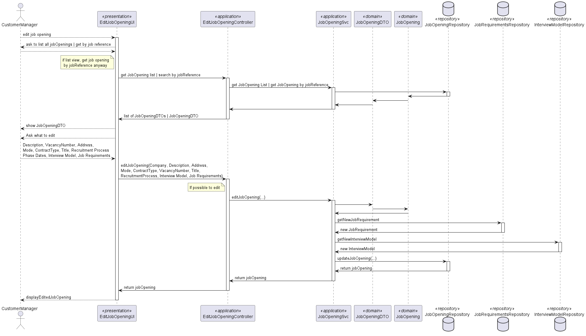

# System Design: Edit Job Opening

## Overview
This design document describes the components and interactions involved in the "Edit Job Opening" feature for the Customer Manager. The system allows the Customer Manager to edit details of a job opening such as description, number of vacancies, address, mode, contract type, title, recruitment process phase dates, interview model, and job requirements.

## Components
- **Actor**
  - CustomerManager: The user who initiates the request to edit a job opening.

- **Presentation Layer**
  - EditJobOpeningUI (UI): The user interface component that interacts with the Customer Manager. It displays job openings and collects the updated information to be edited.

- **Application Layer**
  - EditJobOpeningController (Controller): Handles the request from the UI, processes it, and communicates with the service layer to perform the business logic.
  - JobOpeningSvc (Service): Contains the business logic for fetching and updating job openings. It interacts with repositories to retrieve and persist data.

- **Domain Layer**
  - JobOpeningDTO (DTO): Data Transfer Object used to transfer data between different layers of the application.
  - JobOpening (Domain): The domain model representing a job opening.

- **Repository Layer**
  - JobOpeningRepository (Repository): Interface for accessing job opening data from the database. 
  - JobRequirementsRepository (JRRepository): Interface for accessing job requirements data from the database. 
  - InterviewModelRepository (IMRepository): Interface for accessing interview model data from the database.

## Sequence Diagram
