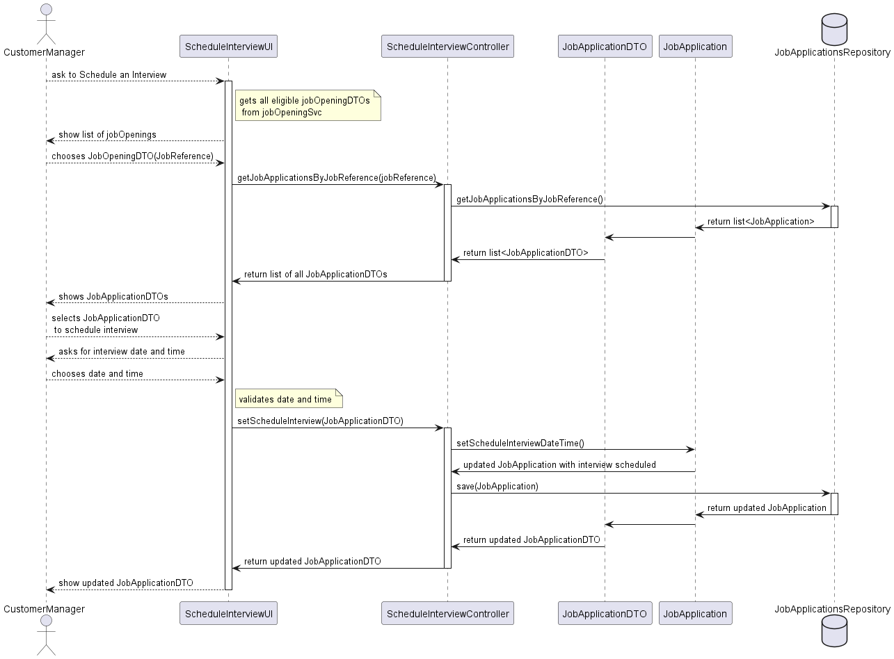

# System Design: Schedule Interview

## Overview
This design document describes the components and interactions involved in the "Schedule Interview" feature for the Customer Manager. The system allows the Customer Manager to record the time and date for an interview with a candidate, ensuring the candidate has passed the screening phase.

## Components
- **Actor**
    - CustomerManager: The user who initiates the request to schedule an interview.

- **Presentation Layer**
  - ScheduleInterviewUI (UI): The user interface component that interacts with the Customer Manager. It displays job openings and candidates eligible for interviews, and collects the scheduling details (date and time) to be recorded.
  
- **Application Layer**
  - ScheduleInterviewController (Controller): Handles the request from the UI, processes it, and communicates with the service layer to perform the business logic.
  - JobApplicationDTO (DTO): Data Transfer Object used to transfer job application data between different layers of the application.
- 
- **Domain Layer**
  - JobApplication (Domain): The domain model representing a job application.

- **Repository Layer**
  - JobApplicationsRepository (Repository): Interface for accessing job application data from the database.

## Sequence Diagram

