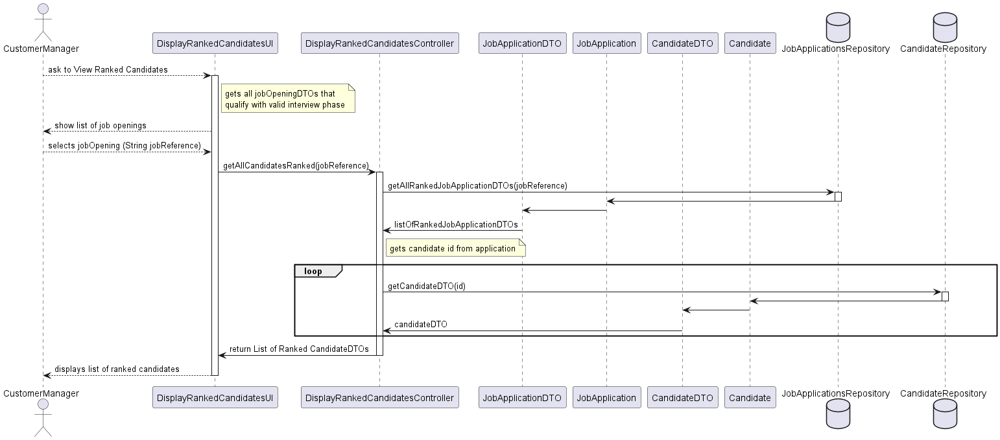

# System Design: Display Ranked Candidates

## Overview
This design document describes the components and interactions involved in the "Display Ranked Candidates" feature for the Customer Manager. The system allows the Customer Manager to view an ordered list of candidates based on their performance in job interviews.

## Components
- **Actor**
    - CustomerManager: The user who initiates the request to view ranked candidates.

- **Presentation Layer**
    - DisplayRankedCandidatesUI (UI): The user interface component that interacts with the Customer Manager. It displays the list of job openings and ranked candidates.
  
- **Application Layer**
    - DisplayRankedCandidatesController (Controller): Handles the request from the UI, processes it, and communicates with the service layer to retrieve ranked candidates.
  
- **Domain Layer**
    - JobApplicationDTO (DTO): Data Transfer Object used to transfer job application data between different layers of the application.
    - CandidateDTO (DTO): Data Transfer Object used to transfer candidate data between different layers of the application.
    - JobApplication (Domain): The domain model representing a job application.
    - Candidate (Domain): The domain model representing a candidate.

- **Repository Layer**
    - JobApplicationsRepository (Repository): Interface for accessing job application data from the database.
    - CandidateRepository (Repository): Interface for accessing candidate data from the database.

## Sequence Diagram
