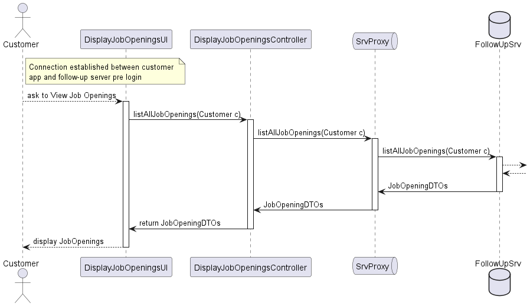

# System Design: Display Job Openings

## Overview
This design document details the components and interactions involved in the "Display Job Openings" feature for the Customer. The system allows the Customer to view a list of job openings, including details such as job reference, position, active since date, and the number of applicants.

## Components
- **Actor**
  - Customer: The user who initiates the request to view job openings.
  
- **Presentation Layer**
  - DisplayJobOpeningsUI: The user interface component that interacts with the Customer. It displays the list of job openings.
  
- **Application Layer**
  - DisplayJobOpeningsController: Handles the request from the UI, processes it, and communicates with the service layer to retrieve job openings.
  
- **Domain Layer**
  - JobOpeningDTO: Data Transfer Object used to transfer job opening data between different layers of the application.

## Sequence Diagram
